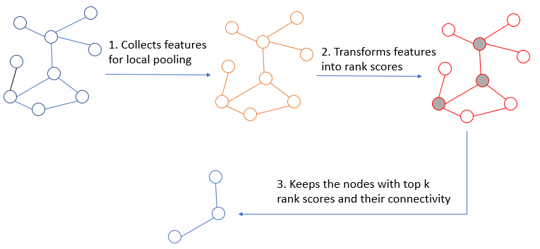
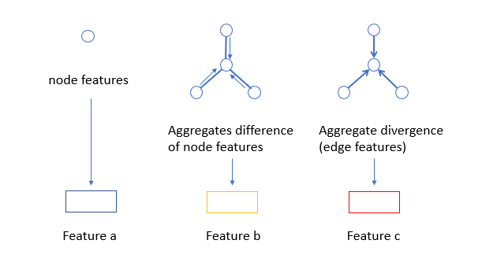
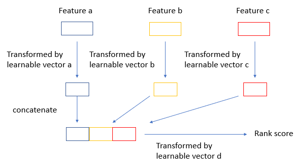

# Spektral implementation of smoothpool
Spektral implementation of smoothpool. 

Here is an overall description of smoothpool:

During step 1, we collect three features for pooling:

During step 2, the rank score is produced by 4 learnable vectors as follow:

In this way, we utilize node features, graph topology and edge features when producing rank score.

## Requirments
- tensorflow
- spektral
- numpy
- networkx

## Usage
python main.py

Use python main.py -h for the help information.

## Todo
- Evaluate on large-scale dataset.