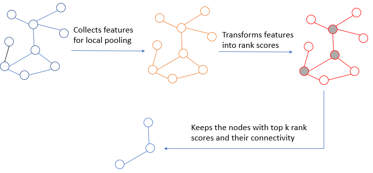
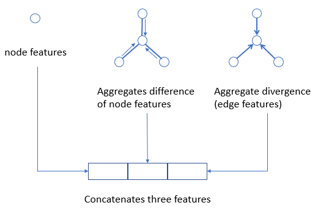

# Spektral implementation of smoothpool
spektral implementation of smoothpool. Here is an overall description of smoothpool:

The features for pooling is collected by:

An mlp is used to transform features to rank scores.

## Requirments
- tensorflow
- spektral
- numpy
- networkx

## Usage
python train.py

## Todo
- Evaluate on large-scale dataset.
- Revise and detail readme.